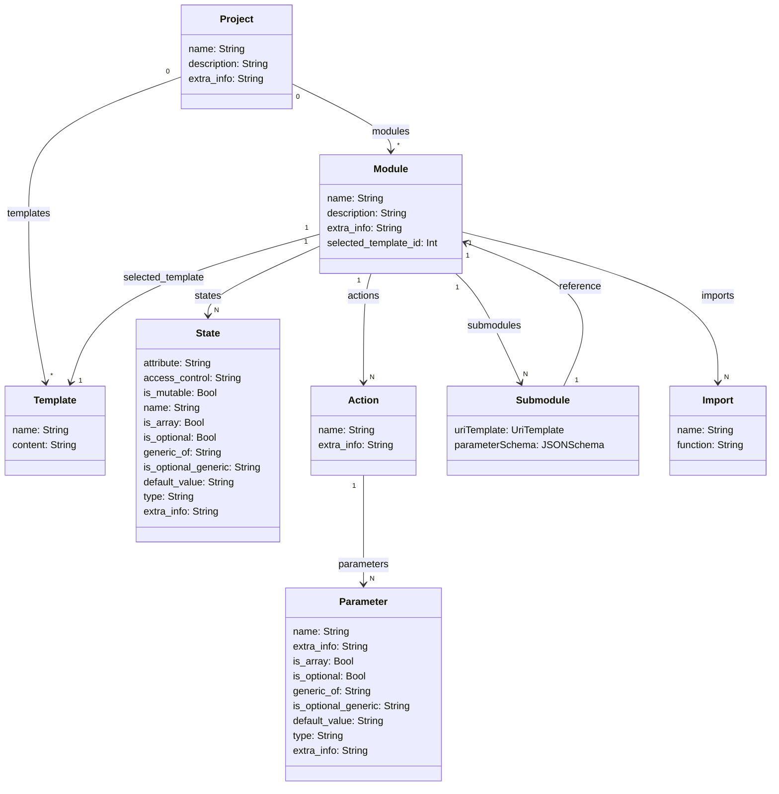

# Codegena

Codegena is a python-flask app for bootstrapping new app ideas.
You can model your app in states and actions, and create modules to bundle them. 
Please check the diagram below.



### Templates
Currently there are 2 default templates one for [TCA](https://github.com/pointfreeco/swift-composable-architecture) and one for Apple's vanilla MVVM.
More templates will be introduced in future. Please feel free to submit a PR with your template I will happly accept them.


#### Swift TCA Template
You can access it here. [swift-tca](project/client/static/templates/swift/tca/example1.txt)

Example output.
Here we constructed a module with 2 states namely username and password and 2 actions loginButtonTapped and loginResponceReceived.
You can then separate the private functions to another file to an extension. There are some planned changes to pipeline and slice the outputs
so we dont need to do this separation manually.

```swift
import ComposableArchitecture
import Foundation
public struct AuthModule: Reducer {

    public init() {}

    public struct State: Equatable {
        public var password: String = ""
        public var username: String = ""
    }

    public init(
		password: String = "",
		username: String = ""
	) {
		password = password
		username = username
	}
    public enum Action: Equatable {
        case loginButtonTapped
        case loginResponceReceived(token: TaskResult<String>)
    }

    public var body: some ReducerOf<Self> {
        Reduce { state, action in
            switch action {
                case .loginButtonTapped:
                    return self.loginButtonTapped()
                case .loginResponse(let token):
                    return self.loginResponse(token: token)
            }
        }
    }

    private func loginButtonTapped() -> Effect<AuthModule.Action> {
        return .none
    }
    private func loginResponse(token :TaskResult<String>) -> Effect<AuthModule.Action> {
        return .none
    }
```

#### Swift MVVM Template
[swift-mvvm](project/client/static/templates/swift/mvvm/example1.txt)

```swift
@Observable
public final class AuthModule {

    public var password: String = ""
    public var username: String = ""

    public func loginButtonTapped() {
        
    }
}
```

### Proxy objects and Helpers

There is also proxy objects for the models where you can easily access to helper functions like 
```sh
{{ state }}

```

instead of 
```sh
{{ state.attribute }}{{ state.access_control }}{{ state.is_mutable }}{{ state.name }}: {{ state.type }}  {{ state.default_value }}

```

This would make the templates more readable as well as easier to create and edit.

## Demo
You can visit [codegena.cihan.rocks](https://codegena.cihan.rocks) and start using it.

## Local Installation

First go to github and [create an app](https://docs.github.com/en/apps/creating-github-apps/registering-a-github-app/registering-a-github-app).
After creating the app create a .env file in the project's root directory. It must contain
```sh
GH_CLIENT_ID=_your_client_id_
GH_CLIENT_SECRET=_your_client_secret_
```

Also you need to remove the networks from docker-compose-yml file and define a path for database.

you can then fire up the docker with the command 
```sh
$ docker-compose up -d --build
```

## Roadmap
- Better support for OpenAPI parsing
- More templates default templates for popular frameworks and concepts
- More proxy objects for languages like python and kotlin
- Support for standalone package creation (i.e. spm package and overridable functions).
- Support for template pipelinening
